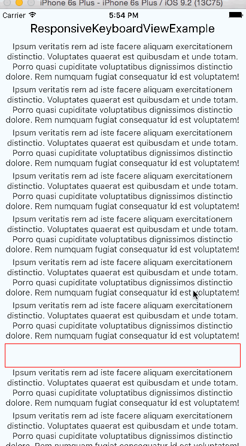

react-native-responsive-keyboard-view
==
> The responsive view when you open or close keyboard for React Native

[]()[]()

[](https://nodei.co/npm/react-native-responsive-keyboard-view/)


Demo
---



Installation
==

in Cli
---
```
npm i react-native-responsive-keyboard-view -S
```

in JavaScirpt
---
```
import ResponsiveKeyboardView from 'react-native-responsive-keyboard-view'
```


Usage
===
```
<ResponsiveKeyboardView>
  <TextInput style={{height:40, borderColor: 'red', borderWidth: 1,}} />
</ResponsiveKeyboardView>
```

Contributing
==
Of course! Welcome :)


License
==
MIT

